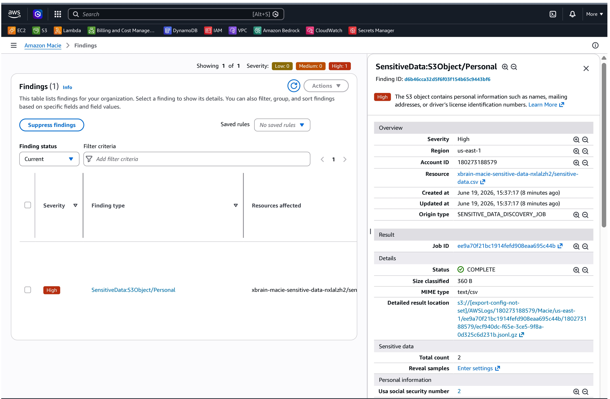
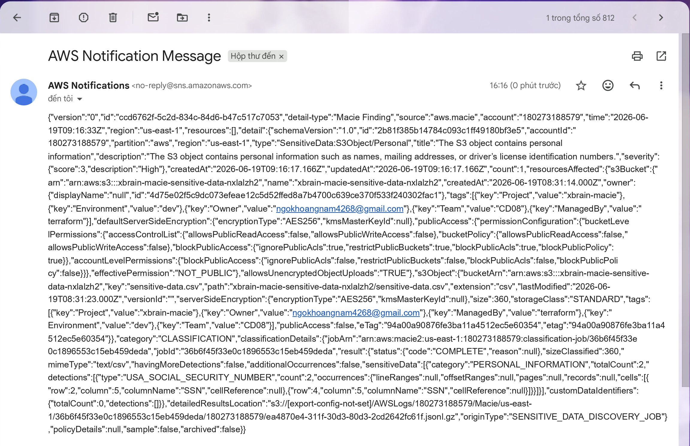

# Amazon Macie + EventBridge + SNS Alert

## 🎯 Mục tiêu

- Quét phát hiện dữ liệu nhạy cảm (PII) trên S3 bucket bằng Amazon Macie.
- Tự động gửi cảnh báo qua Email bằng cách cấu hình EventBridge bắt event `Macie Finding` và chuyển tiếp đến SNS Topic.

---

## ⚙️ Các bước thực hiện

1. Tạo Amazon SNS Topic và cấu hình Email Subscription (đã confirm).
2. Triển khai S3 Bucket và upload file dữ liệu nhạy cảm mẫu `sensitive-data.csv`.
3. Kích hoạt Amazon Macie và cấu hình một One-time Discovery Job quét bucket S3 vừa tạo.
4. Tạo EventBridge Rule để bắt sự kiện từ Macie và gửi thông báo tới SNS Topic.

---

## 📸 Kết quả minh chứng

### 1. Dữ liệu nhạy cảm phát hiện trong Amazon Macie (Findings)

### 2. Email thông báo nhận được từ SNS chứa chi tiết Macie Finding (JSON)

---

## Kết luận

Amazon Macie quét và phát hiện thành công dữ liệu nhạy cảm PII trong S3 Bucket, đồng thời hệ thống tự động hóa phản ứng sự cố gửi email cảnh báo chi tiết qua SNS hoạt động đúng như thiết kế.
