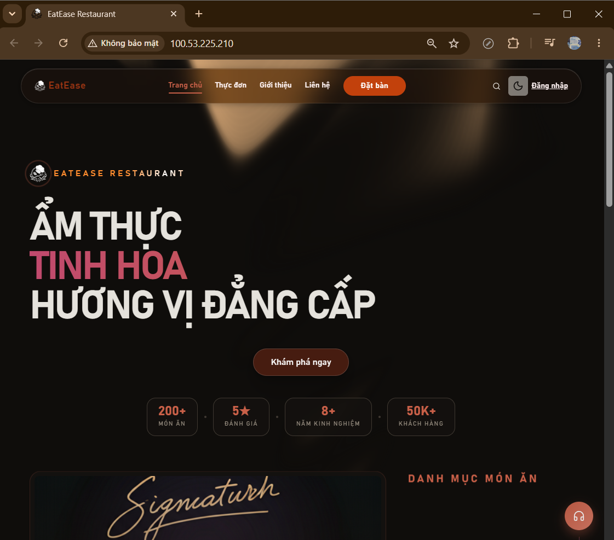

# W8 Evidence — Terraform Final Project: Deploy a Web App on AWS

## Cover

| Field            | Value                                                                                               |
| ---------------- | --------------------------------------------------------------------------------------------------- |
| Student          | Ngo Kim Hoang Nam                                                                                   |
| Team             | CD08                                                                                                |
| Repository       | https://github.com/NamHoang4268/namhoang-aws-accelerator-p2/tree/main/cloud/w8/XB_EatEaseRestaurant |
| Terraform folder | `/terraform`                                                                                        |
| Date             | 2026-06-06                                                                                          |
| Application      | EatEase Restaurant — Web App (React + Vite frontend)                                                |
| Stack            | VPC + EC2 + RDS MySQL + S3 + Security Groups                                                        |
| IaC Tool         | Terraform >= 1.9.0                                                                                  |

---

## Architecture

```
Internet
    │  HTTP :80
    ▼
EC2 (public subnet — us-east-1a)
├── nginx serving React frontend (client/dist/)
└── Security Group: allow 80, 443, 22

RDS MySQL (private subnet — us-east-1a/b)
└── Security Group: allow 3306 from EC2 SG only

S3 Bucket
└── Static assets storage (versioning + AES256 encryption)

Remote State
└── S3 bucket: namhoang-terraform-state-eatease
└── DynamoDB: namhoang-terraform-lock (state locking)
```

---

## Cấu trúc Terraform

```
terraform/
├── bootstrap/
│   └── main.tf              # Tạo S3 backend + DynamoDB lock (chạy 1 lần)
├── modules/
│   └── vpc/
│       ├── main.tf          # VPC, subnets, IGW, route tables, DB subnet group
│       ├── variables.tf
│       └── outputs.tf
├── scripts/
│   └── user_data.sh         # EC2 bootstrap: cài nginx, clone repo, build, serve
├── main.tf                  # Providers, VPC module, EC2, RDS, S3, Security Groups
├── variables.tf
├── outputs.tf
└── terraform.tfvars
```

---

## 5 Steps theo đề

### Step 1 — VPC Module với public + private subnets

- VPC CIDR: `10.0.0.0/16`
- Public subnet: `10.0.1.0/24` (us-east-1a) — EC2 web server
- Private subnet 1: `10.0.2.0/24` (us-east-1a) — RDS primary
- Private subnet 2: `10.0.3.0/24` (us-east-1b) — RDS standby (bắt buộc cho DB subnet group)
- Internet Gateway + Route Table gắn vào public subnet

### Step 2 — EC2 trong public subnet

- Instance type: `t3.medium` (cần RAM cho Vite build)
- Ubuntu 22.04 LTS
- `user_data.sh` tự động: cài Node.js 20 + nginx → clone repo → build frontend → serve qua nginx
- Nginx cấu hình SPA mode (`try_files $uri /index.html`) cho React Router

### Step 3 — RDS MySQL trong private subnet

- Engine: MySQL 8.0
- Instance: `db.t3.micro`
- Không public accessible — chỉ EC2 mới kết nối được (qua Security Group)
- DB subnet group trải qua 2 AZ theo yêu cầu AWS

### Step 4 — S3 bucket cho static assets

- Tên: `eatease-static-<random_hex>` (random suffix tránh trùng global)
- Bật versioning
- Server-side encryption AES256

### Step 5 — Security Groups

| Security Group | Inbound     | From            |
| -------------- | ----------- | --------------- |
| EC2 web SG     | 80, 443, 22 | `0.0.0.0/0`     |
| RDS SG         | 3306        | EC2 web SG only |

RDS không nhận traffic từ internet — chỉ EC2 (qua SG reference), đảm bảo database không bị expose.

---

## Remote State — S3 Backend + DynamoDB

```hcl
backend "s3" {
  bucket         = "namhoang-terraform-state-eatease"
  key            = "eatease/terraform.tfstate"
  region         = "us-east-1"
  encrypt        = true
  dynamodb_table = "namhoang-terraform-lock"
}
```

- State file lưu trên S3 (encrypted)
- DynamoDB lock ngăn 2 người apply cùng lúc gây conflict

---

## Kết quả Deploy

- **Web URL:** `http://100.53.225.210`
- **RDS Endpoint:** `eatease-mysql.c69iwg2wm5mi.us-east-1.rds.amazonaws.com:3306`
- **S3 Bucket:** `eatease-static-336a6055`

Giao diện EatEase Restaurant hiển thị thành công qua trình duyệt sau khi `terraform apply`.


---

## Terraform Outputs

```
web_url        = "http://100.53.225.210"
ec2_public_ip  = "100.53.225.210"
rds_endpoint   = "eatease-mysql.c69iwg2wm5mi.us-east-1.rds.amazonaws.com:3306"
s3_bucket_name = "eatease-static-336a6055"
```

---

## Lệnh chạy

```bash
# Bước 1: Tạo S3 backend + DynamoDB (1 lần duy nhất)
cd terraform/bootstrap
terraform init && terraform apply

# Bước 2: Deploy toàn bộ hạ tầng
cd ..
export TF_VAR_db_password='YourPassword'
terraform init
terraform plan
terraform apply

# Dọn dẹp sau khi xong
terraform destroy
```
