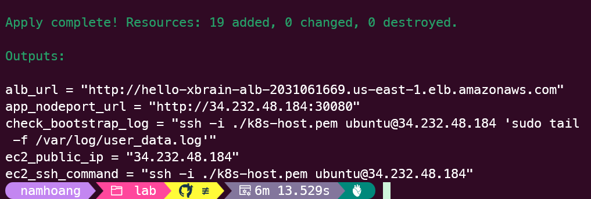
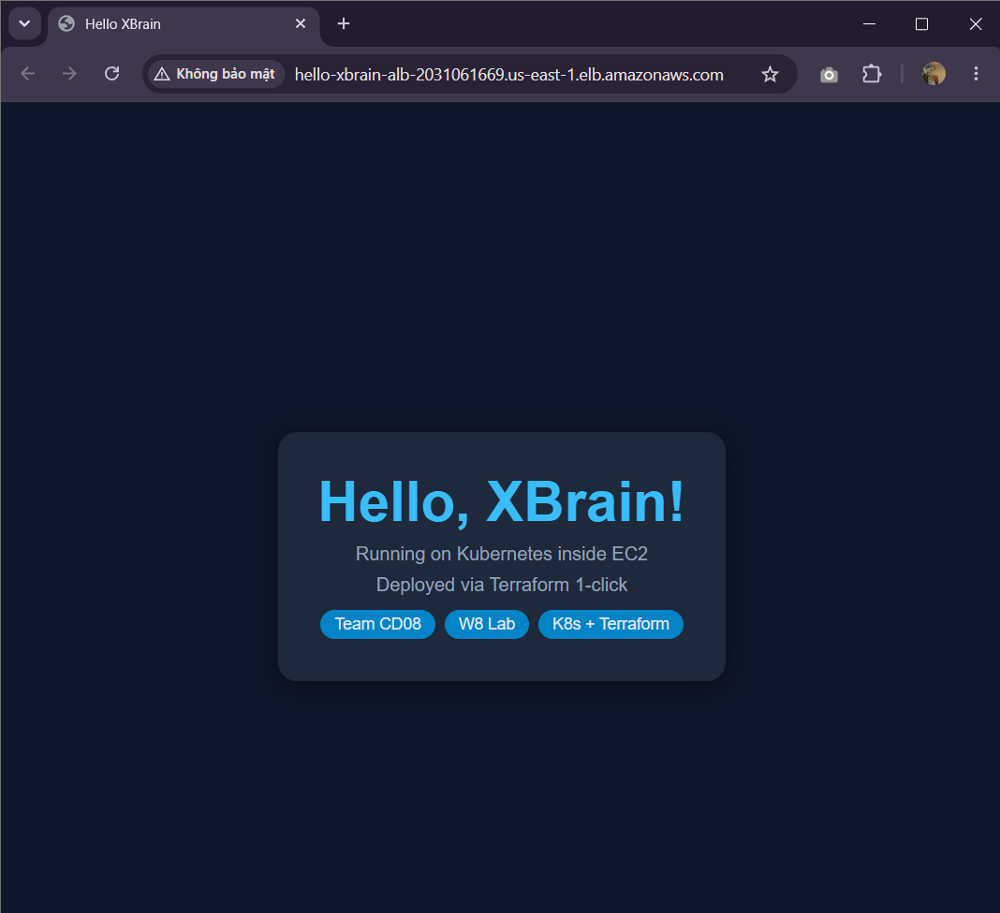
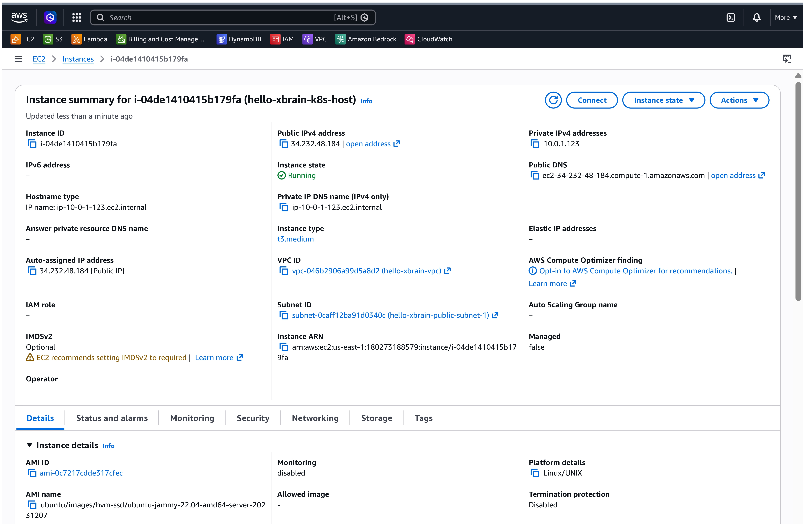
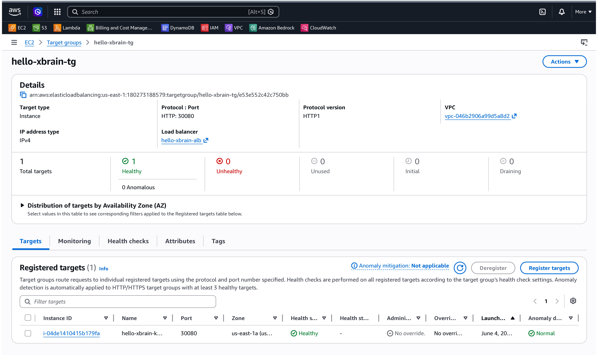
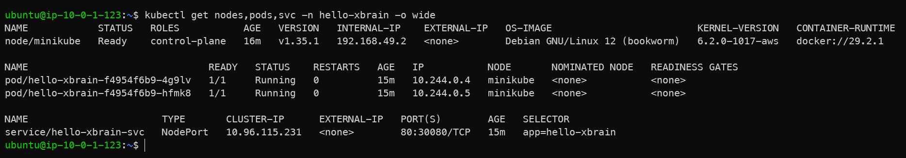

# W8 Evidence Pack: K8s on AWS — Terraform 1-Click

## Section 1 — Cover

| Field               | Value                                                                                                                            |
| ------------------- | -------------------------------------------------------------------------------------------------------------------------------- |
| Learner             | Ngo Kim Hoang Nam                                                                                                                |
| Team                | Team CD08 — XBrain Phase 2                                                                                                       |
| Repository          | [namhoang-aws-accelerator-p2](https://github.com/NamHoang4268/namhoang-aws-accelerator-p2)                                       |
| Prior Week Evidence | [W7 Evidence](../../../xbrain-source-g5/w7/docs/W7_evidence.md)                                                                  |
| Date                | 2026-06-04                                                                                                                       |
| Application         | Hello, XBrain! web app running inside Kubernetes (nginx:1.25 base)                                                               |
| Stack               | VPC (2 Public Subnets), EC2 (t3.medium), Minikube (Docker driver), NodePort Service (30080), AWS Application Load Balancer (ALB) |
| IaC                 | Terraform (5 providers: aws, tls, local, time, null)                                                                             |
| Live URL            | http://hello-xbrain-alb-910598446.us-east-1.elb.amazonaws.com                                                                    |

---

## Section 2 — Architecture & Design Decisions

### Architecture Diagram

```
                       Internet
                           │  HTTP :80
                           ▼
     ┌─────────────────────────────────────────────────────┐
     │  Application Load Balancer (public)                  │
     │  hello-xbrain-alb-910598446.us-east-1.elb.amazonaws.com │
     └─────────────────────┬───────────────────────────────┘
                           │  HTTP :30080
                           ▼
     ┌─────────────────────────────────────────────────────┐
     │  EC2 t3.medium Host (Ubuntu 22.04)                  │
     │  Security Group: Inbound 30080 (from ALB), 22 (SSH)  │
     │                                                     │
     │  socat (Host Port 30080 ──► Minikube IP:30080)       │
     │                                                     │
     │  ┌──────────────────────────────────────────────┐   │
     │  │  minikube (Docker driver)                    │   │
     │  │  Minikube IP: 192.168.49.2                   │   │
     │  │                                              │   │
     │  │  Namespace: hello-xbrain                     │   │
     │  │                                              │   │
     │  │  Deployment: hello-xbrain (2 replicas)       │   │
     │  │  Pods: nginx:1.25 + initContainer for HTML   │   │
     │  │                                              │   │
     │  │  Service: NodePort ──► exposed on 30080      │   │
     │  └──────────────────────────────────────────────┘   │
     └─────────────────────────────────────────────────────┘
```

### Design Decision Table

| #   | Architecture Component  | Choice                                | Justification                                                                                                                                                                                                                                                                                                              |
| --- | ----------------------- | ------------------------------------- | -------------------------------------------------------------------------------------------------------------------------------------------------------------------------------------------------------------------------------------------------------------------------------------------------------------------------- |
| 1   | **Kubernetes Platform** | **Minikube (Docker driver)** on EC2   | Single-node K8s running inside Docker on t3.medium. Highly cost-effective for demo purposes (~$0.04/hr) compared to AWS EKS (~$0.10/hr control plane fee + node costs), while fulfilling the full K8s API capability requirements.                                                                                         |
| 2   | **Instance Size**       | **t3.medium (2 vCPUs, 4GB RAM)**      | Minikube requires at least 2 vCPUs and 20GB disk space. Running it on `t2.micro` or `t3.micro` leads to out-of-memory errors and kernel freezes during cluster startup.                                                                                                                                                    |
| 3   | **Port Exposure**       | **NodePort Service + Socat Bridging** | Minikube container driver isolates the Kubernetes network inside a Docker bridge network. The ALB target group cannot route traffic directly to the Docker bridge IP. Using `socat` to forward port `30080` from the EC2 host interface to the Minikube container's port `30080` bridges this gap seamlessly and reliably. |
| 4   | **AWS Load Balancer**   | **Application Load Balancer (ALB)**   | Receives external public HTTP traffic on port 80 and performs round-robin forwarding to the EC2 target group on port 30080. Performs active health checking to ensure traffic is only routed when the Minikube app is healthy.                                                                                             |

---

## Section 3 — Providers & 1-Click Automation Chain

### Providers Used

1. **`hashicorp/aws`**: Provisions AWS infrastructure resources (VPC, Subnets, Internet Gateway, Route Tables, Security Groups, Key Pair, EC2 Instance, ALB, Target Group, Target Attachment, Listener).
2. **`hashicorp/tls`**: Generates a secure RSA-4096 private key dynamically.
3. **`hashicorp/local`**: Saves the generated private key to the local file system (`k8s-host.pem`) with restrictive permissions (0600) so the developer can immediately SSH into the instance.
4. **`hashicorp/time`**: Introduces a controlled 90-second wait after the EC2 instance reports `running` to ensure the SSH daemon is ready to accept connections.
5. **`hashicorp/null`**: Executes a remote-exec provisioner to SSH into the EC2 instance, monitor the `/var/log/user_data.log` bootstrap log, and block until `/tmp/bootstrap_done` is created successfully.

### The 1-Click "Chicken-and-Egg" Solution

Deploying Kubernetes resources (Deployments, Services) directly via the `hashicorp/kubernetes` provider requires cluster credentials and endpoints to be present at Terraform **plan time**. However, in a 1-click bootstrap, the cluster (Minikube on EC2) does not exist yet when the plan is created.

To solve this, our Terraform configuration:

- Relies on `user_data.sh` to install Docker, start Minikube, and execute the `kubectl apply` commands locally inside the EC2 instance.
- Employs a `null_resource` with a `remote-exec` provisioner that connects via SSH to monitor the bootstrap progress.
- This ensures that when `terraform apply` finishes, the cluster is guaranteed to be fully initialized and serving the application.

---

## Section 4 — Deployed Infrastructure Evidence

### 1. Successful `terraform apply` Output

_Screenshot of the terminal showing `Apply complete!` along with outputs such as `alb_url` and `ec2_public_ip`._



### 2. Custom Web Application Interface (ALB Access)

_Screenshot of the browser accessing the `alb_url` displaying the "Hello, XBrain! - Team CD08 - W8 Lab" webpage._



### 3. AWS EC2 Instance Dashboard

_Screenshot of the EC2 list on the AWS Console showing the `hello-xbrain-k8s-host` instance in the `Running` state._



### 4. AWS ALB Target Group Health Status

_Screenshot of the `hello-xbrain-tg` Target Group on the AWS Console showing the EC2 Target in the `Healthy` state on port `30080`._



### 5. Kubernetes Resources Status (Inside EC2)

_Screenshot of the terminal after SSHing into the EC2 instance and executing the command: `kubectl get nodes,pods,svc -n hello-xbrain -o wide`._



---

## Section 5 — Cost & Safety Discipline

### Pre-flight Safety Setup

- **MFA on AWS Root Account**: Enabled.
- **Budget Alert**: Configured at $80 limit with SNS email notification.
- **Cost Discipline Tagging**: Applied standard tags (`Project=hello-xbrain`, `Team=CD08`, `Owner=ngokhoangnam4268@gmail.com`, `Environment=dev`) to all resources using Terraform `default_tags`.

### Estimated Monthly Cost Breakdown

| Component                 | Quantity | Monthly Cost (Est.) | Hourly Cost | Description                                         |
| ------------------------- | -------- | ------------------- | ----------- | --------------------------------------------------- |
| **EC2 t3.medium**         | 1        | ~$30.37             | ~$0.0416    | Run Docker, Minikube, and the app                   |
| **AWS ALB**               | 1        | ~$16.42             | ~$0.0225    | Public HTTP router and entrypoint                   |
| **EBS Volume (gp3 20GB)** | 1        | ~$1.60              | -           | Host OS and Docker images                           |
| **NAT Gateway / EIP**     | 0        | $0.00               | $0.00       | Single public subnet setup avoids NAT Gateway costs |
| **Total**                 |          | **~$48.39**         | **~$0.064** | **Cost-effective K8s environment**                  |

> [!TIP]
> Always execute `terraform destroy -auto-approve` after completing the lab to release resources and avoid unexpected charges.

---

## Section 6 — Troubleshooting & Key Learning

### 502 Bad Gateway Error and Socat Solution

During the initial deployment, although the Kubernetes pods were in the `Running` state and the NodePort Service was configured to port `30080`, accessing the application via the ALB resulted in a `502 Bad Gateway` error, and the Target Group reported an `Unhealthy` status.

**Root Cause:**
Running Minikube with `driver=docker` initializes a dedicated container representing the Kubernetes Node. When exposing NodePort `30080`, this port is only bound to the internal IP of the Minikube container (e.g., `192.168.49.2:30080`) and is not automatically bound to the public IP or VPC IP of the EC2 Host. Consequently, the ALB health check sent to `EC2_IP:30080` is refused.

**Solution:**
The `socat` utility was added to the installation process in `user_data.sh` to act as a traffic bridge (port forwarding) between the network interface of the EC2 Host and the virtual network interface of Minikube:

```bash
apt-get install -y socat
MINIKUBE_IP=$(sudo -u ubuntu minikube ip)
nohup socat TCP-LISTEN:30080,fork,reuseaddr TCP:${MINIKUBE_IP}:30080 > /var/log/socat.log 2>&1 &
```

This command listens for all traffic sent to port `30080` on the EC2 instance and directly forwards it to port `30080` of the Minikube Node. Immediately after this solution was applied, the Target Group status changed to `Healthy`, and the webpage loaded successfully via the ALB.
