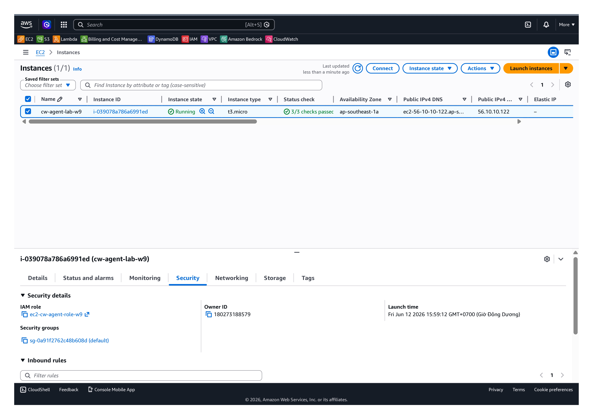
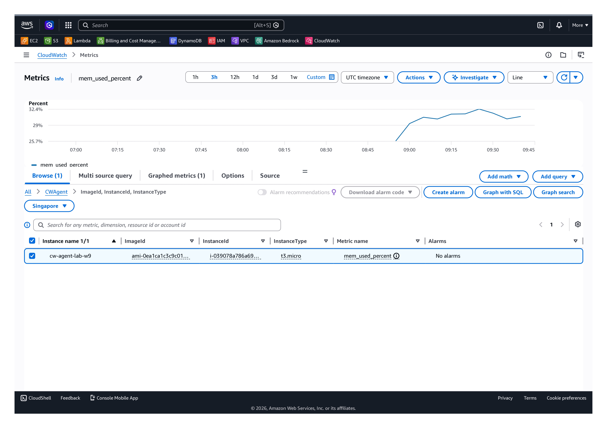
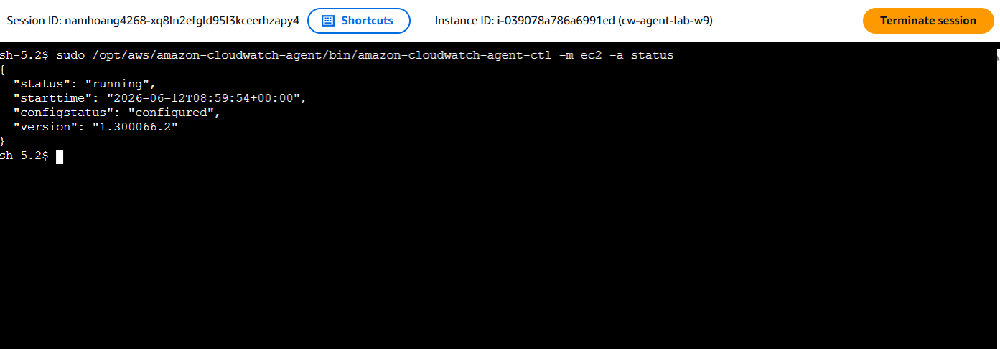

# CloudWatch Agent

## Mục tiêu

* Thu thập metrics nâng cao (memory, disk)

---

## Các bước

1. Tạo IAM Role (CloudWatchAgentServerPolicy)
2. Attach vào EC2
3. Cài agent
4. Start agent

---

## Kết quả

### IAM Role

### Metrics

### Agent running

---

## Kết luận

CloudWatch Agent hoạt động và gửi metrics custom lên CloudWatch.
