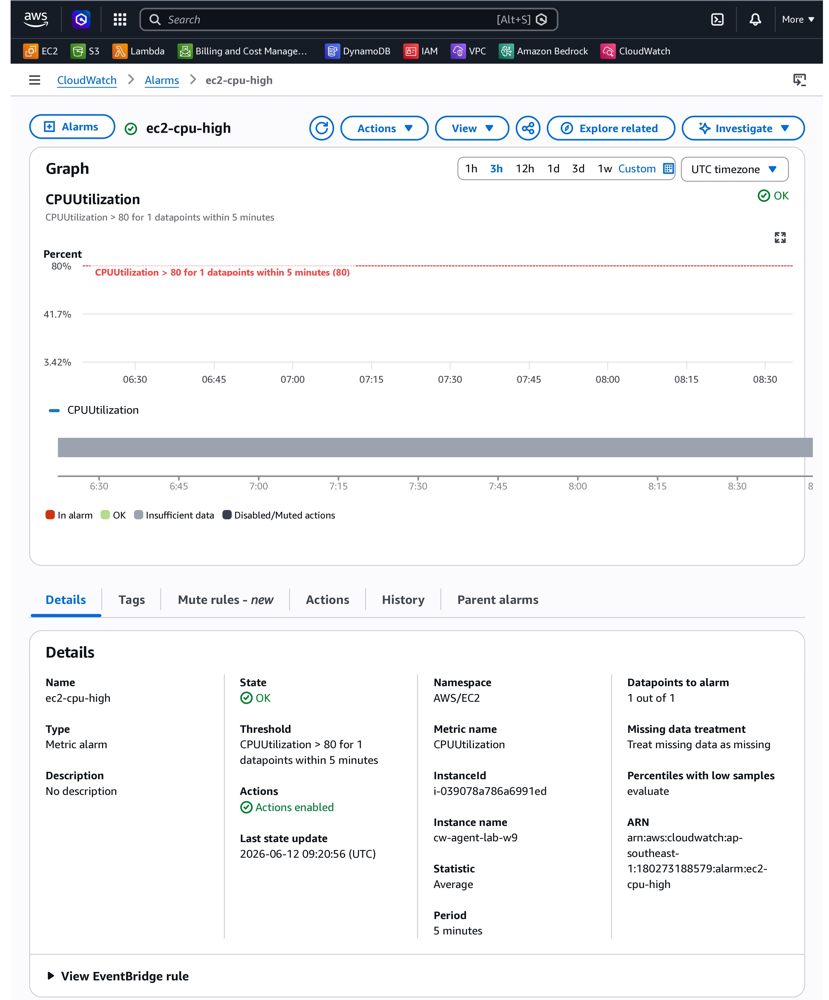
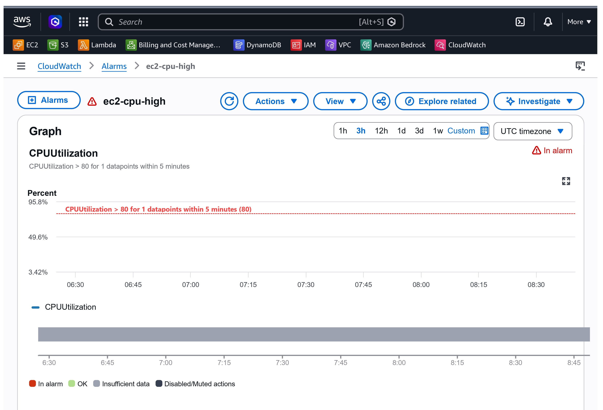
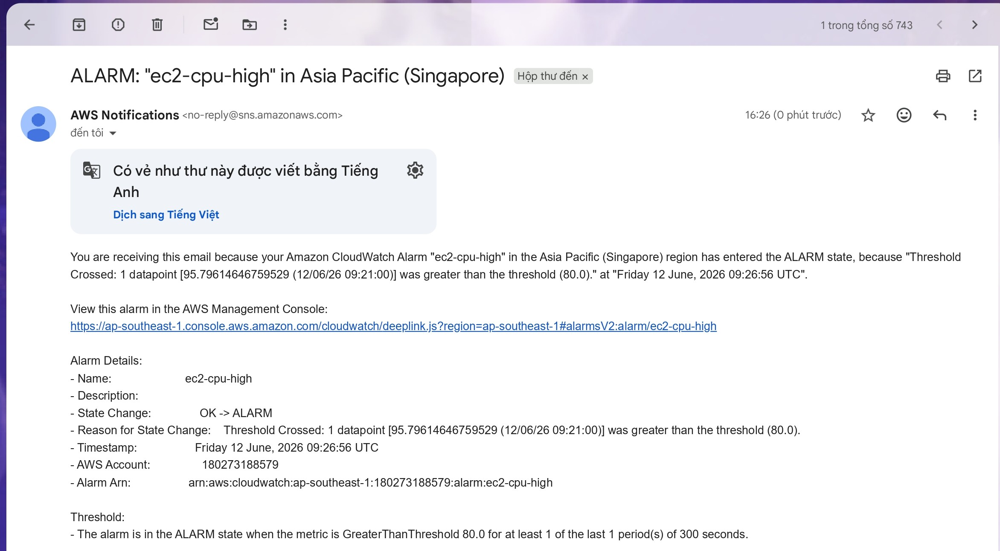

# CloudWatch Alarm + SNS

## 🎯 Mục tiêu

* Monitor CPU EC2
* Gửi email khi CPU > 80%

---

## ⚙️ Các bước thực hiện

1. Tạo SNS Topic
2. Subscribe email
3. Tạo CloudWatch Alarm
4. Gắn SNS vào Alarm

---

## 📸 Kết quả minh chứng

### 1. Alarm ở trạng thái OK (Bình thường)

### 2. Alarm ở trạng thái IN ALARM (Cảnh báo)

### 3. Email nhận được từ SNS

---

## Kết luận

Alarm hoạt động đúng và gửi email khi CPU vượt threshold.

