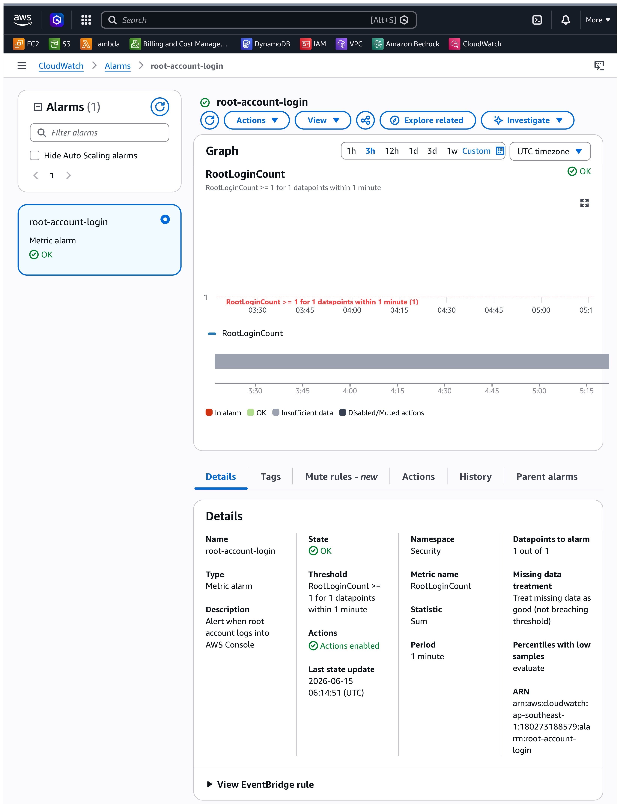
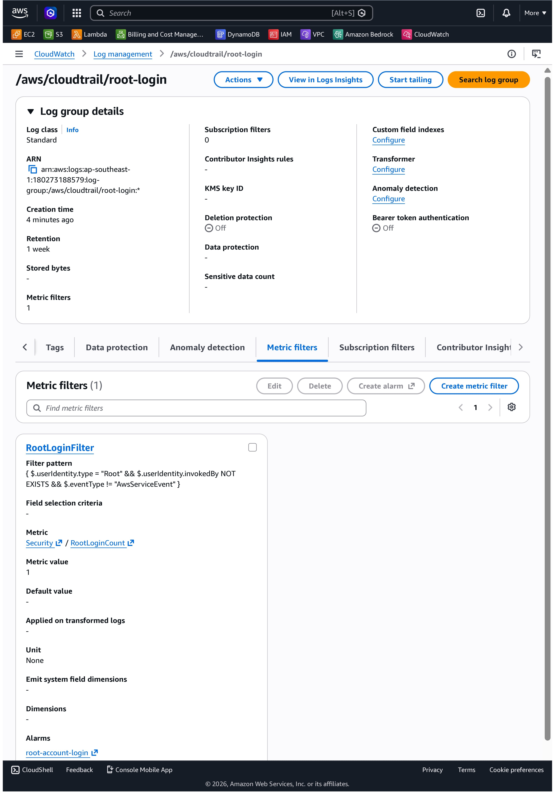
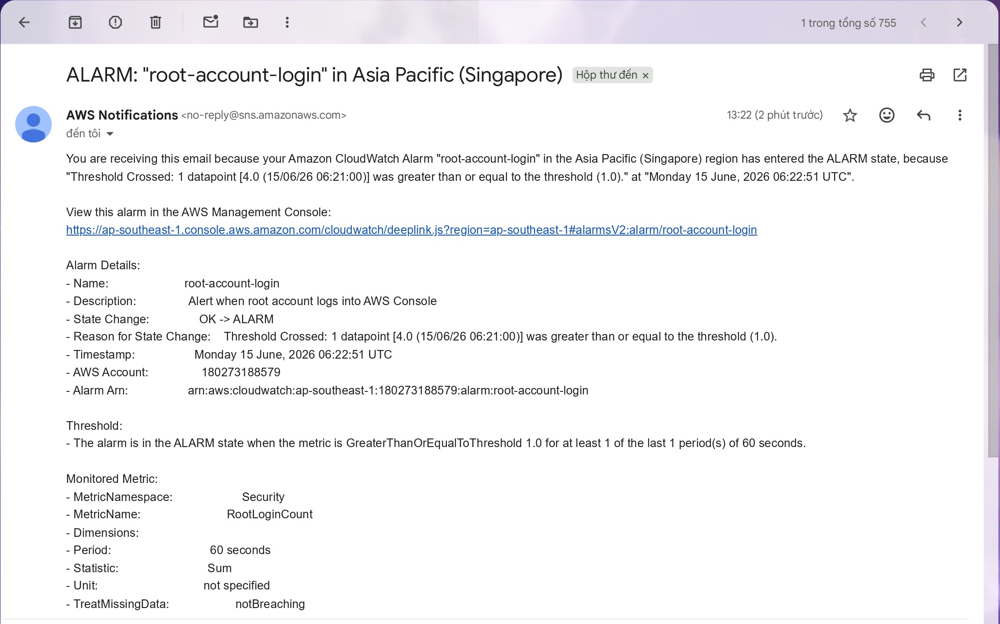

# Evidence — Alert on AWS Root Account Login

## Mục tiêu

Thiết lập hệ thống cảnh báo tự động khi có đăng nhập vào AWS bằng tài khoản Root thông qua CloudTrail → CloudWatch Metric Filter → CloudWatch Alarm → SNS → Email.

## Kiến trúc

```
Root Login Event
    → CloudTrail (bắt API call ConsoleLogin)
    → CloudWatch Logs (/aws/cloudtrail/root-login)
    → Metric Filter (pattern: userIdentity.type = "Root")
    → Custom Metric: Security/RootLoginCount
    → CloudWatch Alarm (threshold >= 1)
    → SNS Topic → Email Alert
```

## Infrastructure (Terraform)

Toàn bộ hạ tầng được tạo bằng Terraform trong thư mục `root-login-alert/`:

| Resource             | Tên                             | Mục đích                                     |
| -------------------- | ------------------------------- | -------------------------------------------- |
| CloudTrail           | `root-login-trail`              | Ghi lại tất cả API calls kể cả Console Login |
| S3 Bucket            | `root-login-trail-<account_id>` | Lưu CloudTrail logs                          |
| CloudWatch Log Group | `/aws/cloudtrail/root-login`    | Stream logs từ CloudTrail                    |
| Metric Filter        | `RootLoginFilter`               | Phát hiện root login event                   |
| CloudWatch Alarm     | `root-account-login`            | Trigger khi RootLoginCount >= 1              |
| SNS Topic            | `root-login-alert-topic`        | Fanout thông báo                             |
| SNS Subscription     | Email                           | Gửi cảnh báo về Gmail                        |

## Screenshots

### 1. CloudWatch Alarm — root-account-login

> Console → CloudWatch → Alarms → root-account-login



**Mô tả:** Alarm `root-account-login` đã được tạo thành công. Cấu hình: metric `RootLoginCount` trong namespace `Security`, threshold `>= 1`, period `60s`. Khi có bất kỳ lần đăng nhập root nào, alarm sẽ chuyển sang trạng thái IN ALARM.

---

### 2. CloudWatch Log Group — Metric Filter

> Console → CloudWatch → Log groups → /aws/cloudtrail/root-login → Metric filters



**Mô tả:** Metric Filter `RootLoginFilter` đã được cấu hình với pattern phát hiện root login:

```
{ $.userIdentity.type = "Root" && $.userIdentity.invokedBy NOT EXISTS && $.eventType != "AwsServiceEvent" }
```

Filter này đếm mỗi lần root account đăng nhập và ghi vào metric `Security/RootLoginCount`.

---

### 3. Email Alert nhận được

> Gmail — email từ AWS Notifications khi alarm fire



**Mô tả:** Email cảnh báo được gửi về `ngokhoangnam4268@gmail.com` ngay sau khi đăng nhập bằng root account. Email chứa thông tin alarm name, metric value và thời điểm xảy ra sự kiện.

---

## Kết luận

Hệ thống hoạt động end-to-end:

- CloudTrail phát hiện root login event
- Metric Filter extract event và tăng counter
- CloudWatch Alarm fire khi counter >= 1
- SNS gửi email thông báo ngay lập tức
